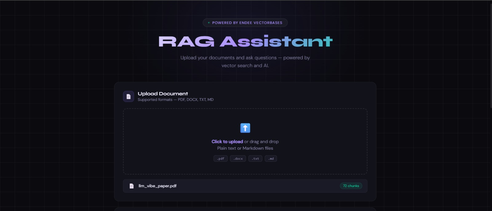
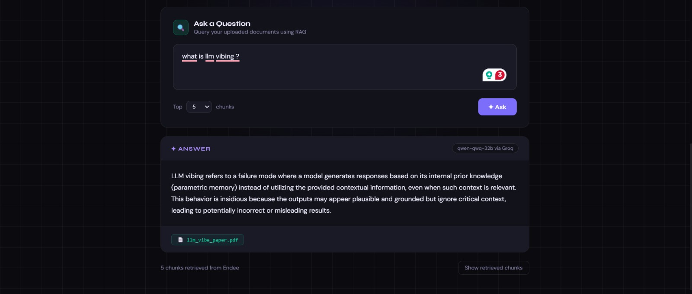

<div align="center">

# RAG Assistant

### Retrieval-Augmented Generation over your documents
**Upload any document. Ask any question. Get precise AI-powered answers.**

[](https://python.org)
[](https://fastapi.tiangolo.com)
[](https://endee.io)
[](https://groq.com)
[](LICENSE)




</div>

---

## What is this?

**RAG Assistant** is an AI application that lets you upload documents (PDF, DOCX, TXT, MD) and ask natural language questions about them. It uses **Retrieval-Augmented Generation (RAG)** — a technique where relevant parts of your documents are retrieved using vector search and passed to an LLM as context, so answers are grounded in your actual content rather than the model's general knowledge.

This project was built on top of the [Endee](https://github.com/endee-io/endee) open-source vector database as part of an AI/ML project evaluation.

---

## Problem Statement

Traditional keyword search fails when users ask questions in natural language. LLMs hallucinate when answering questions about private or domain-specific documents they were never trained on. RAG solves both problems:

- Documents are broken into chunks and stored as **vector embeddings** in Endee
- When a question is asked, the most semantically similar chunks are retrieved
- Only those chunks are sent to the LLM as context — keeping answers accurate and grounded

---

## Demo

| Feature | Screenshot |
|---------|-----------|
| Upload PDF and ingest into Endee |  |
| Ask questions, get precise answers |  |

---

## System Design

```
┌─────────────────────────────────────────────────────────────────┐
│                        USER BROWSER                             │
│                   Beautiful HTML/CSS/JS UI                      │
└─────────────────────┬───────────────────────────────────────────┘
                      │ HTTP
┌─────────────────────▼────────────────────────────────────────────┐
│                    FASTAPI BACKEND                               │
│                                                                  │
│   POST /upload          POST /query          GET /health         │
│        │                     │                                   │
│        ▼                     ▼                                   │
│   [ingest.py]          [retriever.py]                            │
│   Extract text         Embed query                               │
│   Chunk text           Search Endee                              │
│   Embed chunks         Return top-K chunks                       │
│   Upsert to Endee           │                                    │
│        │                    ▼                                    │
│        │              [llm.py]                                   │
│        │              Build context prompt                       │
│        │              Call Groq Qwen-32B                         │
│        │              Return answer                              │
└────────┼────────────────────┼────────────────────────────────────┘
         │                    │
┌────────▼────────┐  ┌────────▼────────────────┐
│   ENDEE (Docker)│  │   GROQ API (Cloud)      │
│   Vector DB     │  │   qwen-qwq-32b model    │
│   Port 8080     │  │   Fast inference        │
│   Cosine search │  └─────────────────────────┘
│   Metadata store│
└─────────────────┘
```

### Ingestion Pipeline

```
Document (PDF/DOCX/TXT/MD)
        │
        ▼
   Extract Text
  (PyMuPDF / python-docx)
        │
        ▼
   Chunk Text
  (500 chars, 80 overlap)
        │
        ▼
   Embed Chunks
  (all-MiniLM-L6-v2, 384-dim)
        │
        ▼
   Upsert to Endee
  (cosine index, with metadata)
```

### Query Pipeline

```
User Question
      │
      ▼
 Embed Question
(all-MiniLM-L6-v2)
      │
      ▼
 Search Endee
(top-K nearest vectors)
      │
      ▼
 Retrieved Chunks
(text + source + score)
      │
      ▼
 Build Prompt
(system + context + question)
      │
      ▼
 Groq Qwen-32B
      │
      ▼
 Precise Answer
```

---

## How Endee is Used

[Endee](https://github.com/endee-io/endee) is the **core vector database** powering all similarity search in this project.

| Operation | Where | What Endee does |
|-----------|-------|-----------------|
| `create_index` | `ingest.py` | Creates a cosine-similarity index with 384 dimensions and INT8 precision |
| `index.upsert()` | `ingest.py` | Stores embedded document chunks with metadata (text, source file, chunk index) |
| `index.query()` | `retriever.py` | Finds the top-K most semantically similar chunks to the user's question |
| Metadata filtering | `retriever.py` | Results are filtered to only return chunks from the user's uploaded files |

**Why Endee over other vector databases?**
- Runs fully locally via Docker — no cloud dependency or API costs
- C++ implementation with AVX2/AVX512/NEON SIMD — extremely fast search
- Payload metadata stored alongside vectors — enables source filtering
- Open source under Apache 2.0

---

## Tech Stack

| Layer | Technology | Purpose |
|-------|-----------|---------|
| Vector Database | [Endee](https://github.com/endee-io/endee) | Store and search document embeddings |
| Embeddings | `sentence-transformers` (all-MiniLM-L6-v2) | Convert text to 384-dim vectors — runs locally, free |
| LLM | Groq API — `qwen/qwen3-32b` | Generate precise answers from retrieved context |
| Backend | FastAPI | REST API — upload, query, and serve frontend |
| Frontend | Vanilla HTML/CSS/JS | Beautiful dark UI with drag-and-drop upload |
| PDF parsing | PyMuPDF (`fitz`) | Extract text from PDF files |
| DOCX parsing | `python-docx` | Extract text from Word documents |
| Containerization | Docker | Run Endee server reliably on all platforms |

---

## Project Structure

```
endee/
└── rag-assistant/               ← Your project lives here (inside forked Endee repo)
    ├── config.py                ← All settings: Endee URL, Groq key, model, chunk size
    ├── ingest.py                ← Load → extract → chunk → embed → upsert to Endee
    ├── retriever.py             ← Embed query → search Endee → return top-K chunks
    ├── llm.py                   ← Build prompt → call Groq Qwen → return clean answer
    ├── api.py                   ← FastAPI: /upload, /query, /health, /sources
    ├── static/
    │   └── index.html           ← Full frontend UI (single file, no build step)
    ├── docs/
    │   └── screenshots/         ← UI screenshots for README
    ├── uploaded_docs/           ← Where uploaded files are saved (auto-created)
    ├── .env                     ← Your API keys (never committed)
    ├── .env.example             ← Safe template to commit
    ├── .gitignore
    ├── requirements.txt
    ├── Dockerfile
    ├── docker-compose.yml
    └── README.md
```

---

## Prerequisites

Before you start, make sure you have:

- **Docker Desktop** — [download here](https://docs.docker.com/desktop/) (required to run Endee on Windows)
- **Python 3.12+** — [download here](https://python.org/downloads/)
- **Git** — [download here](https://git-scm.com/)
- **Groq API Key** (free) — [get one here](https://console.groq.com)

---

## Setup & Installation

### Step 1 — Star and Fork Endee (mandatory)

> This is a mandatory step for project evaluation.

1. Go to [https://github.com/endee-io/endee](https://github.com/endee-io/endee)
2. Click **Star** ⭐
3. Click **Fork** → Fork to your GitHub account

### Step 2 — Clone your fork

```bash
git clone https://github.com/YOUR_USERNAME/endee.git
cd endee/rag-assistant
```

### Step 3 — Get a free Groq API key

1. Go to [https://console.groq.com](https://console.groq.com)
2. Sign up (free)
3. Go to **API Keys** → **Create API Key**
4. Copy the key

### Step 4 — Configure environment

```bash
cp .env.example .env
```

Open `.env` and fill in your key:

```env
GROQ_API_KEY=gsk_your_actual_key_here
ENDEE_BASE_URL=http://localhost:8080
ENDEE_AUTH_TOKEN=
ENDEE_INDEX_NAME=rag_docs
```

### Step 5 — Start Endee vector database (Docker)

```bash
docker run \
  --ulimit nofile=100000:100000 \
  -p 8080:8080 \
  -v ./endee-data:/data \
  --name endee-server \
  --restart unless-stopped \
  endeeio/endee-server:latest
```

**Windows (PowerShell):**
```powershell
docker run `
  --ulimit nofile=100000:100000 `
  -p 8080:8080 `
  -v ./endee-data:/data `
  --name endee-server `
  --restart unless-stopped `
  endeeio/endee-server:latest
```

Verify Endee is running: open [http://localhost:8080/api/v1/health](http://localhost:8080/api/v1/health) — you should see `{"status":"ok"}`.

### Step 6 — Create Python virtual environment

```bash
python -m venv .venv

# macOS / Linux
source .venv/bin/activate

# Windows
.venv\Scripts\activate
```

### Step 7 — Install dependencies

```bash
pip install -r requirements.txt
```

### Step 8 — Start the RAG API

```bash
uvicorn api:app --reload --port 8000
```

### Step 9 — Open the app

Open your browser and go to:

```
http://localhost:8000
```

---

## Usage

1. **Upload a document** — drag and drop or click to upload a PDF, DOCX, TXT, or MD file
2. The document is automatically chunked, embedded, and stored in Endee
3. **Ask a question** in the text area — e.g. *"What is the main argument of this paper?"*
4. Click **Ask** — the system retrieves the most relevant chunks from Endee and generates a precise answer
5. Click **Show retrieved chunks** to see exactly which parts of the document were used

---

## API Endpoints

The FastAPI backend exposes these endpoints — all consumed by the frontend UI at `http://localhost:8000`:

| Method | Endpoint | Description |
|--------|----------|-------------|
| `GET` | `/health` | Check if the server is running |
| `POST` | `/upload` | Receives uploaded file, extracts text, chunks it, embeds it and stores in Endee |
| `POST` | `/query` | Embeds the question, searches Endee for top-K chunks, sends to Groq Qwen, returns answer |
| `GET` | `/sources` | Returns list of all documents ingested in current session |

> All endpoints are called automatically by the frontend — no manual API interaction needed. Simply open `http://localhost:8000` in your browser and use the UI.

---

## Environment Variables

| Variable | Required | Default | Description |
|----------|----------|---------|-------------|
| `GROQ_API_KEY` | Yes | — | Your Groq API key from console.groq.com |
| `ENDEE_BASE_URL` | No | `http://localhost:8080` | Endee server URL |
| `ENDEE_AUTH_TOKEN` | No | `""` | Auth token if Endee is secured |
| `ENDEE_INDEX_NAME` | No | `rag_docs` | Name of the Endee index |

---

## Troubleshooting

| Problem | Solution |
|---------|---------|
| `docker: command not found` | Install Docker Desktop and make sure it's running |
| `endee-server already exists` | Run `docker rm endee-server` then retry |
| `ModuleNotFoundError` | Make sure venv is activated: `.venv\Scripts\activate` |
| `GROQ_API_KEY missing` | Check your `.env` file has the key with no spaces |
| Port 8080 already in use | Stop other services or change port in Docker command |
| `500 Internal Server Error` | Check the uvicorn terminal for the full traceback |

---

## License

This project is licensed under the **Apache License 2.0** — see the [LICENSE](../LICENSE) file.

Endee is open source software by [Endee Labs](https://endee.io), also licensed under Apache 2.0.

---

<div align="center">

Built with [Endee](https://github.com/endee-io/endee) · [Groq](https://groq.com) · [FastAPI](https://fastapi.tiangolo.com)

</div>
